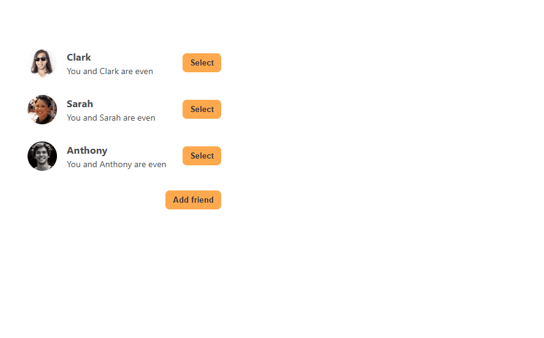

# Eat-n-Split

## Overview

A simple web app to split expenses among friends, inspired by Splitwise.  
Built with **React**, **CSS**, and **local storage**.

## Live Demo

This web app was deployed on vercel, it can be tried in here -> [Eat-n-Split](https://eat-n-split-psi-gold.vercel.app/)

## Preview



## Features

- Add new expenses easily
- Add multiple people
- Track who owes whom
- Split bills evenly or by custom amounts
- Data saved locally (localStorage)

## Technologies

- React
- CSS
- JavaScript
- LocalStorage API

## Getting Started

To run this project locally:

1. Clone the repo:

   ```bash
   git clone https://github.com/davidccgithub/eat-n-split.git
   cd eat-n-split
   ```

2. Install dependencies:

   ```bash
   npm install
   ```

3. Start the server:
   ```bash
   npm start
   ```

The app will run on [http://localhost:3000](http://localhost:3000).

### Disclaimer

This project was built for educational purposes only.
